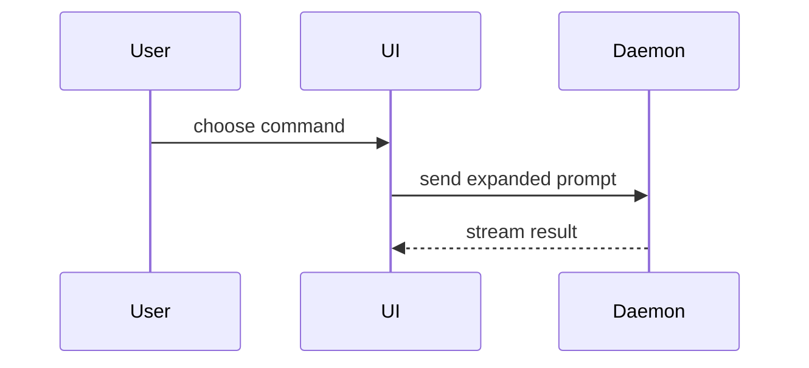

Use this template when writing a PR body. Preserve any additional PR or evidence requirements established by the repository or the user. Formatting a body does not authorize publishing or changing a PR.

```markdown
## Summary

<diagram, diff-sketch, or tree>

## Evidence

- **Before:** <real baseline screenshot/output/failing test run, or state why unavailable>
  **After:** <real screenshot/output/passing test run>

## Merge Danger

**Door:** <one-way or two-way>

<optional: description>

**Blast Radius:** <one-word description>

<optional: potential ramifications of merge>
```

## Sections

Skip preambles and keep prose brief. Read [the glossary discovery policy](../matt-domain-modeling/GLOSSARY-COMPATIBILITY.md), then the applicable project glossary; use its domain language. PR drafting is a reader, not a glossary migration or creation workflow.

### Summary

Choose the smallest view that makes the key point clear.

- Show logic or an algorithm as pseudocode:

```text
on(save)
  if content is unchanged
    return cached result
  write new content
  return fresh result
```

- Show runtime control flow as a call tree:

```text
submitForm
  createSession
    persistPrompt
    launchAgent
  navigateToSession
```

- Show UI structure as a component tree, including relevant state and module boundaries:

```text
<SessionPage> (apps/example/src/routes/session.tsx)
  useSessionEvents()
  <SessionToolbar>
    <RunSkillButton> (packages/ui)
```

- Show file responsibility or a broad refactor as a shallow file tree:

```text
src/
├── commands/       # parses user actions
├── sessions/       # owns session state
└── transport/      # sends API requests
```

- Show component interaction, control flow, or data flow with Mermaid:



- Use `diff` when the point is what changes and the surrounding shape already exists. Match the diff shape to the topic.

For a component change:

```diff
 <SessionPage>
   useSessionEvents()
   <SessionToolbar>
+    <RunSkillButton />
   <SessionTimeline>
+    <SkillResultCard />
```

For a file-layout change:

```diff
 src/
 ├── commands/
+│   └── show-me.ts       # expands the slash command
 ├── sessions/
-└── transport.ts
+└── transport/
+    ├── client.ts
+    └── stream.ts
```

For a call-tree or call-stack change:

```diff
 submitForm
   createSession
     persistPrompt
+    expandSkillMention
     launchAgent
-  navigateToSession
+  navigateToSession
+    subscribeToEvents
```

For a state or control-flow change:

```diff
 on(save)
-  write content
+  if content is unchanged
+    return cached result
+  write new content
+  invalidate cache
```

- Show the whole block when most of it is new, omitted context would hide ownership or order, or the reader needs a copyable target shape:

```ts
function expandSkill(command: string): string {
  const skillName = command.slice(1);
  return `use the ${skillName} skill`;
}
```

#### Guidance

Place each visual next to the short text it supports. Keep only the calls, files, props, states, and boundaries needed to answer the current question or resolve the discussion point. Use one or several visual forms as needed; don't overwhelm the reader.

### Evidence

Give concrete, truthful evidence that the change works. Prefer a genuine before/after comparison when a baseline exists. Never invent, simulate, relabel, or imply before/after evidence that was not actually captured; if no valid baseline exists, say so plainly and provide the strongest real after evidence available. Screenshots are S-tier when the environment supports them. Execution-based evidence (tests or console output) is A-tier. Show the actual relevant command and result; honor repository-specific verification and evidence requirements.

### Merge Danger

State whether the change is a one-way or two-way door. Two-way doors are reversible; one-way doors are not or are costly to reverse. A PR that is cheap to roll back is lower risk. Changes involving destructive actions or hard-to-reverse decisions are one-way doors.

Describe the blast radius: the potential impact or scope of the change. Consider relevant effects such as layout shifts, consumer breakages, and mobile responsiveness. Keep the assessment specific to the actual change.
